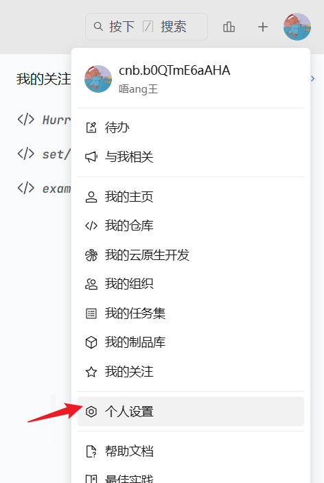
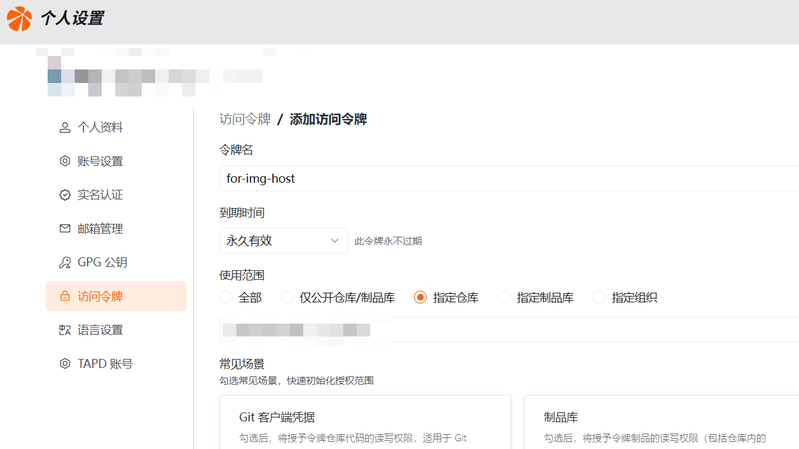
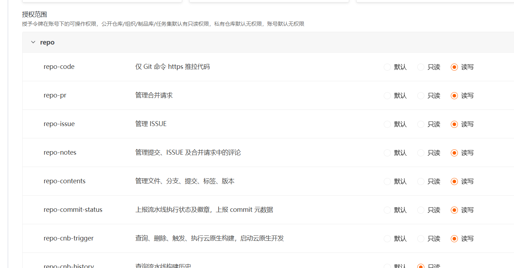
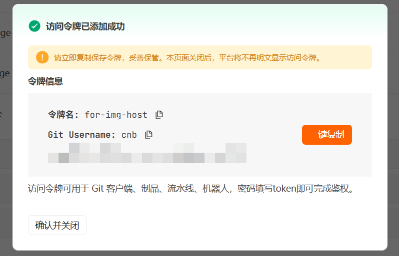

# hw-img-host

> [!TIP]
> 一些思路参考了[cnb](https://github.com/wujinpai/cnb)项目，在此表示感谢.

基于 **EdgeOne Pages Functions** + **CNB 对象存储** 的无服务器图片托管服务。支持拖拽上传、客户端 WebP 压缩、缩略图生成，并提供可调节的压缩质量和上传密码保护。


## 功能特性

- 拖拽或点击上传图片
- 客户端 WebP 压缩，滑块自由调节质量（10% ~ 100%）
- 可选生成缩略图，一键开关控制
- 上传密码保护（JWT 登录认证，7天过期）
- 上传进度实时显示
- 图片画廊浏览已上传图片
- 图片通过 EdgeOne 边缘函数代理，自带 CORS 跨域支持
- 基于 Vue 3 + shadcn-vue + TailwindCSS 构建

## 技术栈

| 层级     | 技术                                 |
| -------- | ------------------------------------ |
| 前端     | Vue 3 + TypeScript + Vite            |
| UI       | shadcn-vue + TailwindCSS v4 + lucide |
| 后端     | EdgeOne Pages Functions              |
| 图片处理 | 客户端 Canvas API (WebP 编码)        |
| 存储     | CNB 对象存储 (cnb.cool)              |
| 图片代理 | EdgeOne Edge Functions (边缘函数)    |

## 架构

```
Browser (Vue 3)
├── 登录 → POST /api/auth/login { password }
│   └── node-functions/api/[[default]].ts (Express)
│       ├── routes/auth.ts: 校验 UPLOAD_PASSWORD，返回 JWT (7天)
│       └── 前端 useAuth composable: 存 token 到 localStorage，axios 拦截器自动附加
├── 选择图片 → 客户端 Canvas WebP 压缩 → 可选缩略图生成
├── 服务端上传 → POST /api/upload/img (multipart/form-data, multer 单文件 5MB, 需 Bearer token)
│   └── routes/upload.ts: authMiddleware → 接收文件 → uploadToCnb() → CNB API → 返回代理链接
└── 展示代理图片链接

Image serving:
GET /img-api/* (eg. https://img.example.com/img-api/path/to/img.webp)
└── edge-functions/img-api/[[path]].ts (EdgeOne Edge Function)
    └── 代理到 CNB 对象存储 + CORS + 30s 缓存
```

## 快速开始

### 环境要求

- **Node.js**: `^20.19.0` 或 `>=22.12.0`
- **pnpm**: `11.0.9`（package.json 已锁定版本）

### 安装

```sh
pnpm install
```

### 开发运行

```sh
pnpm dev
```

访问 `http://localhost:5173`。

### 常用命令

| 命令              | 说明                        |
| ----------------- | --------------------------- |
| `pnpm dev`        | 启动 Vite 开发服务器        |
| `pnpm build`      | 类型检查 + 构建生产版本     |
| `pnpm type-check` | 仅运行 TypeScript 类型检查  |
| `pnpm lint`       | ESLint 检查并自动修复       |
| `pnpm format`     | Prettier 格式化 `src/` 目录 |
| `pnpm preview`    | 本地预览生产构建            |

## 环境配置

在 EdgeOne 控制台中设置以下环境变量（不在 `.env` 文件中配置）：

| 变量              | 说明                                                          | 示例                       |
| ----------------- | ------------------------------------------------------------- | -------------------------- |
| `BASE_IMG_URL`    | 图床域名，**结尾必须带斜杠**                                  | `https://img.example.com/` |
| `SLUG_IMG`        | CNB 图床仓库名                                                | `your-username/your-repo`  |
| `TOKEN_IMG`       | CNB 个人访问令牌                                              | `xxxx`                     |
| `UPLOAD_PASSWORD` | 上传密码（同时作为 JWT 密钥；未设置时登录和上传接口将不可用） | `your-secret-123`          |

> **密码保护**：设置 `UPLOAD_PASSWORD` 后，访问图床需先通过 `/login` 登录获取 JWT token，后续请求需携带 Bearer token。未设置 `UPLOAD_PASSWORD` 则登录接口返回错误，上传接口也因缺少 JWT 密钥而不可用。

## 获取 TOKEN_IMG

1. 登录 [CNB 官网](https://cnb.cool/)，点击右上角头像 → **个人设置**

   

2. 选择左侧 **访问令牌**，关联你的图床仓库（提前创建一个空仓库即可）

   

3. 授权范围选到最大（如有安全顾虑，请参考[官方文档](https://cnb.cool/docs)）

   

4. 点击 **生成 Token**，复制生成的令牌

   

## 项目结构

```
hw-img-host/
├── src/                           # 前端源码
│   ├── main.ts                    # 应用入口
│   ├── App.vue                    # 根组件
│   ├── views/
│   │   ├── HomeView.vue           # 主页面（上传设置 + 上传器 + 结果展示）
│   │   ├── GalleryView.vue        # 图片画廊页面
│   │   └── LoginView.vue          # 登录页面（密码认证）
│   ├── components/
│   │   ├── public/
│   │   │   └── FileUploader.vue   # 核心上传组件（压缩/缩略图/上传逻辑）
│   │   └── ui/                    # shadcn-vue 组件
│   │       ├── button/            # Button
│   │       ├── input/             # Input（密码输入）
│   │       ├── label/             # Label（表单标签）
│   │       ├── progress/          # Progress（上传进度条）
│   │       ├── slider/            # Slider（压缩质量滑块）
│   │       └── switch/            # Switch（缩略图开关）
│   ├── composables/
│   │   └── useAuth.ts             # JWT 认证（login/logout/token 管理 + axios 拦截器）
│   ├── router/
│   │   └── index.ts               # 路由配置：/ (首页)、/gallery (画廊)、/login (登录)
│   ├── lib/
│   │   └── utils.ts               # cn() 工具函数 (clsx + tailwind-merge)
│   └── assets/
│       └── main.css               # TailwindCSS + shadcn-vue CSS 变量
├── node-functions/                # Node 函数 (后端 API)
│   └── api/
│       ├── [[default]].ts         # Express 入口，挂载 /auth 和 /upload 子路由
│       ├── routes/
│       │   ├── auth.ts            # POST /auth/login — 密码验证 + JWT 签发
│       │   └── upload.ts          # POST /upload/img（multer 单文件 5MB，需 Bearer token）
│       ├── _auth.ts               # getSecret() + authMiddleware (JWT 校验)
│       ├── _utils.ts              # uploadToCnb() / buildImageUrl()
│       └── _reply.ts              # 统一响应格式 { code, msg, data }
├── edge-functions/                # 边缘函数 (图片代理)
│   └── img-api/
│       └── [[path]].ts            # 动态路由: GET /img-api/* → CNB 代理
├── public/                        # 静态资源
├── img/                           # 文档图片资源
├── eslint.config.ts               # ESLint 扁平配置
├── vite.config.ts                 # Vite 配置
├── components.json                # shadcn-vue 配置
└── package.json
```

## 上传流程

### 客户端压缩 + 服务端中转

> 因 CNB 收紧了上传域名的 CORS 限制，客户端直传已不可用，统一走服务端中转。

1. **登录认证**：`POST /api/auth/login` 获取 JWT token，存入 localStorage
2. **选择文件**：拖拽或点击选择图片（≤ 20MB）
3. **客户端压缩**：Canvas API 将图片转为 WebP 格式，按用户设定的质量压缩；若压缩后仍超过 4.5MB（EdgeOne Node Functions 请求体上限 6MB），自动迭代降低尺寸与质量
4. **缩略图生成**（可选）：基于压缩后的图片生成缩略图
5. **服务端中转**：`POST /api/upload/img`（multipart/form-data，需 Bearer token），multer 接收 `file` 与可选 `thumbnail` 后由服务端上传至 CNB
6. **展示链接**：返回 EdgeOne 代理链接（带 CORS）和 CNB 原始链接

## 贡献

欢迎提交 Issue 或 Pull Request。
